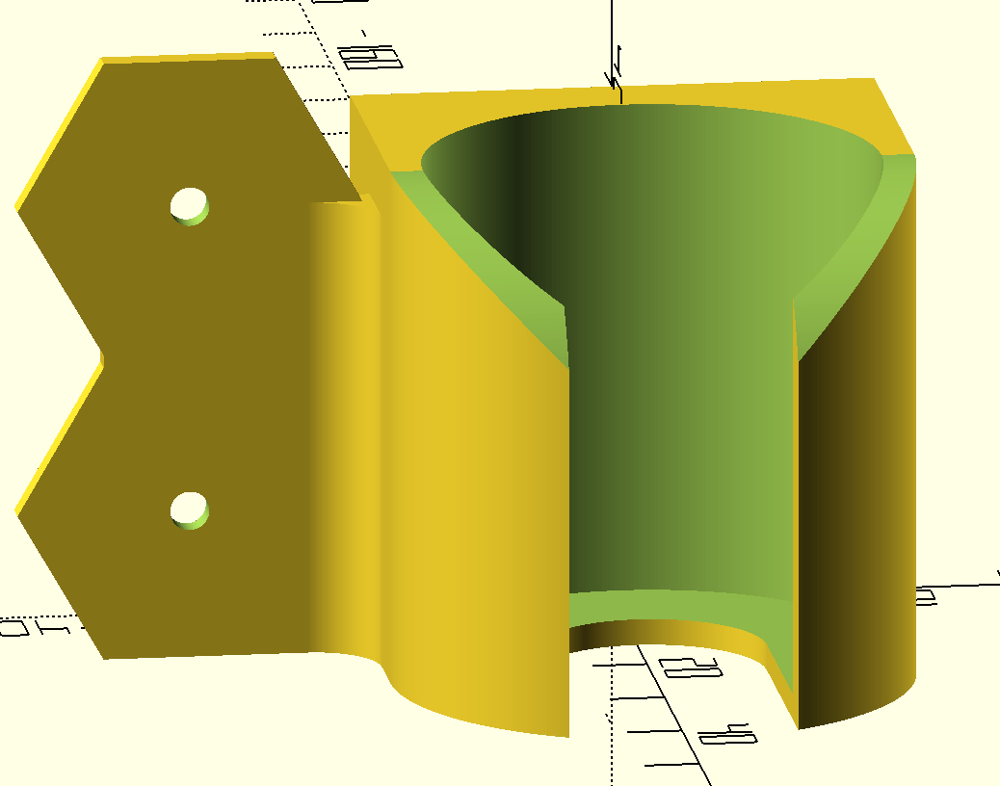
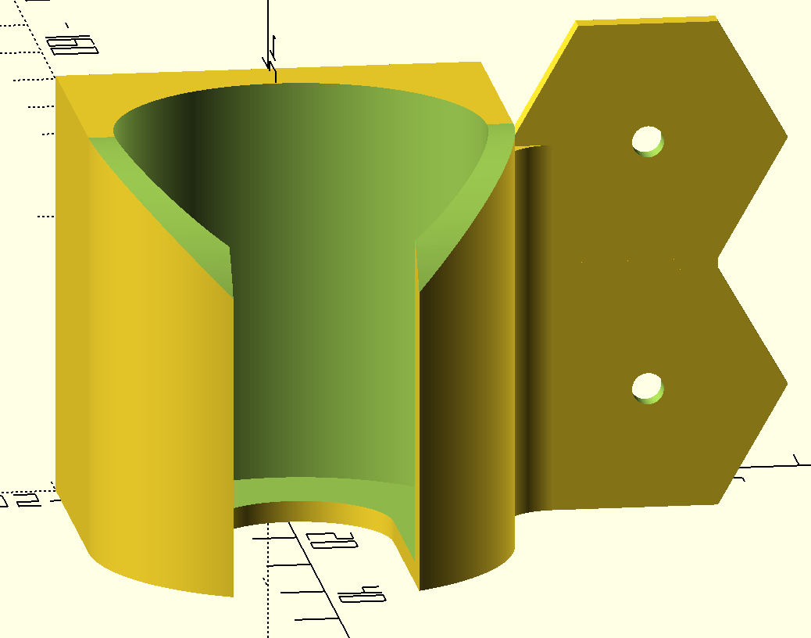
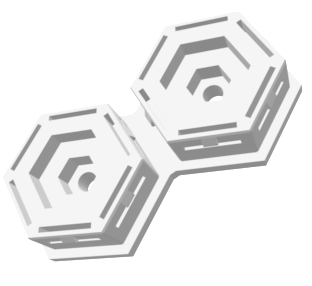
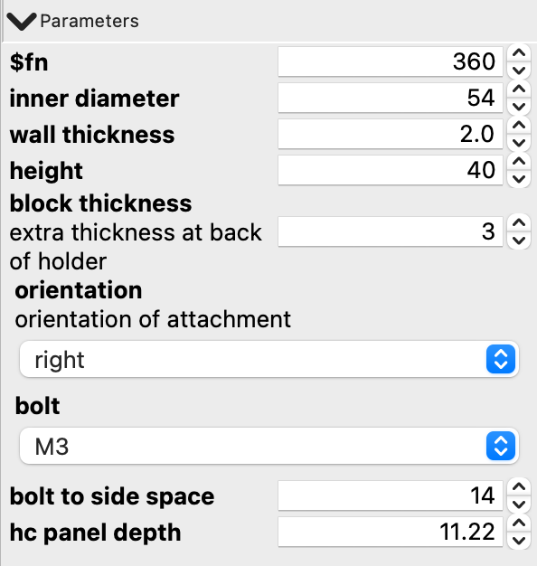

# Ultimate Bottle Holder

I have this long 3DLack spray can, that I wanted to mount on my honeycomb panel. I tried to find a side-mounted bottle holder to waste as little space on my HC panel as possible. I found a few, but none had the correct inner diameter.

Using OpenSCAD I designed a customizable bottle holder. I can now print bottle holders with any diameter and any height that connect to either the left or the right side of my HC panel

Smaller bottles don't take that much space and can be mounted on the panel directly.

The holder is connected to the HC panel using the [connectors](https://www.printables.com/model/511970-honeycomb-wall-system-openscad-connectors) designed by [James Gilliland](https://www.printables.com/@neclimdul).
I added STL files for M3, M4 and M5 connectors.

## Customizable features
Below image show the customizable features of the bottle holder

### inner diameter
For the 3DLack bottle I used 55 as inner diameter.

### height
For small bottles I used 40. For the large 3DLack bottle I used 60.

### wall thickness
For wall thickness I used 2.0.

### block thickness
At the wall side of the holder, a block is appended. This parameter sets the thickness of that block. The total thickness at the wall side of the holder thus is `wall thickness + block thickness`.

### orientation
- `left` draws the attachement on the left side
- `right` draws the attachment on the right side
- `center` does not draw an attachment but provides countersunk holes in the back of the holder. For a height < 40, it draws a single hole. For height >= 40 it draws two countersunk holes.
- `none` only draws the bottle holder. No countersunk holes no attachment.

### bolt
I used M3. The model has options for M2.5, M3, M4 and M5.

### bolt to side space
This is the distance between the center of the bolt holes on the clip and the side of the panel. For my panels, which do not have a border, this distance is 14 mm. Make sure to correctly measure this value before printing the model.

### hc panel depth
This sets the distance between the back of the holder and the left or right attachment. For my panel this is a little more than 11mm.
